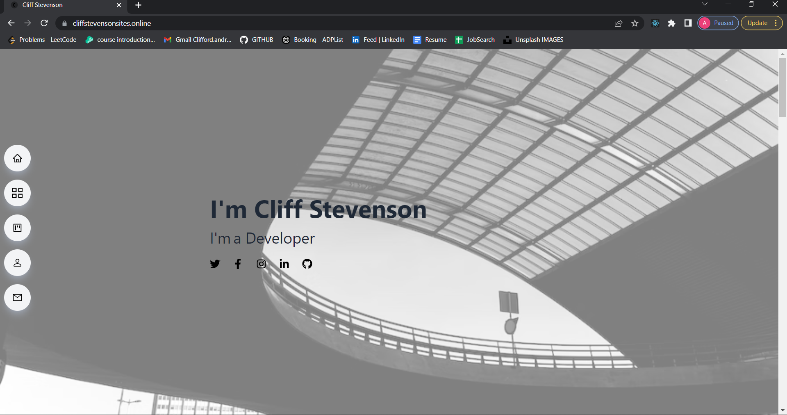

# My Porfolio

## This React.js project was designed so that colleagues and other professionals can see who I am, contact me and provide feedback on current projects.  

Designed my portfolio website with React (Vite) and deployed with hostinger. Initialized a working contact-me form with GetForm and linked all my socials and resume. It's styled with react-icons and is fully responsive for mobile devices and all screen sizes.

* React.js and Tailwind CSS used to efficiently generate a user-friendly, responsive website
* Initialized a working contact-me form with GetForm
* TypeAnimation imported to create a moving animation to increase engagement with the page
* React Hooks like useState deployed to manage state across the application
* Linked all of my socials and resume with react-icons
* Deployed with hostinger

## Visit my website

## Find a bug? 
feel free to contact me via email
